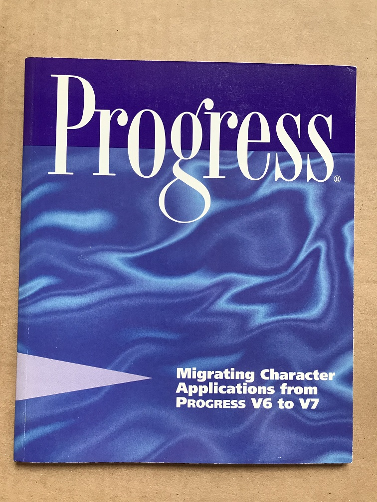

About
=====

It's my personal page. Here I show my interests and developments.

Book collection
===============

My book collection about databases and transaction processing.

### Unix System Laboratories Tuxedo System books

1. Product Overview and Master Index

2. Transaction Manager Administrator's Guide

3. Transaction Manager Reference Manual

4. Transaction Manager Programmer's Guide

5. Application Development Guide

6. FML Programmer's Guide

### Novell Tuxedo System books

1. Administration Guide
 

2. Application Development and Administration

### Oracle v5 books

1. SQL*Plus User's Guide Version 2.0

2. SQL*Plus Designer's Reference Version 2.0

3. SQL*Report User's Guide Version 1.0

4. PL/SQL User's Guide and Reference Version 1.0

5. Oracle Database Administrator's Guide Version 5.1

### Oracle v6 books

1. Database Administrator's Guide

2. SQL Language Reference Manual

3. SQL*ReportWriter Reference Manual

4. Utilities User's Guide

5. Errors Messages and Codes Manual

6. PL/SQL User's Guide and Reference

### Progress v7 books

1. System Administration Reference

2. System Administration Guide

3. Programming Handbook

4. Basic Develompent Tools

5. Language Tutorial

6. Toolset tutorial

7. Extended Development Tools

8. Pocket Progress

9. Language Reference Volume 1

10. Language Reference Volume 2

11. Report Builder

12. Network Guide

13. Portability Guide

14. Master Index and Glossary

15. Help Development Guide

16. External Program Interface

17. Database Design Guide

18. Migrating Character Applications from Progress v6 to v7

